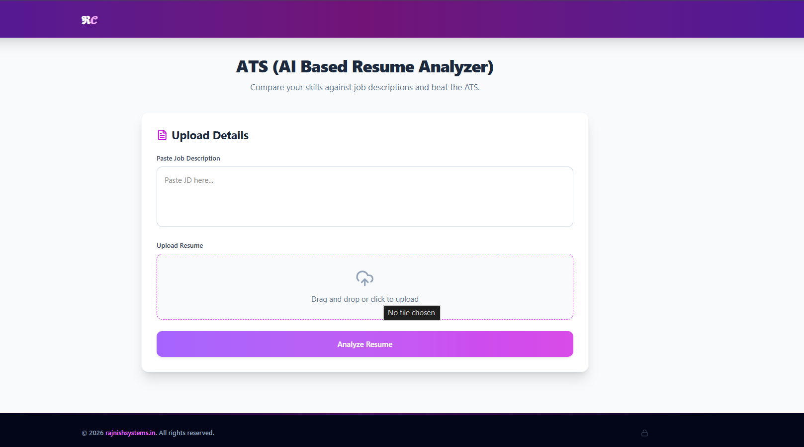
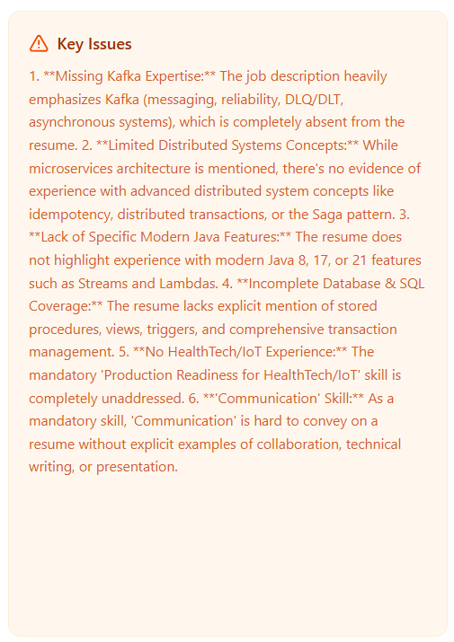
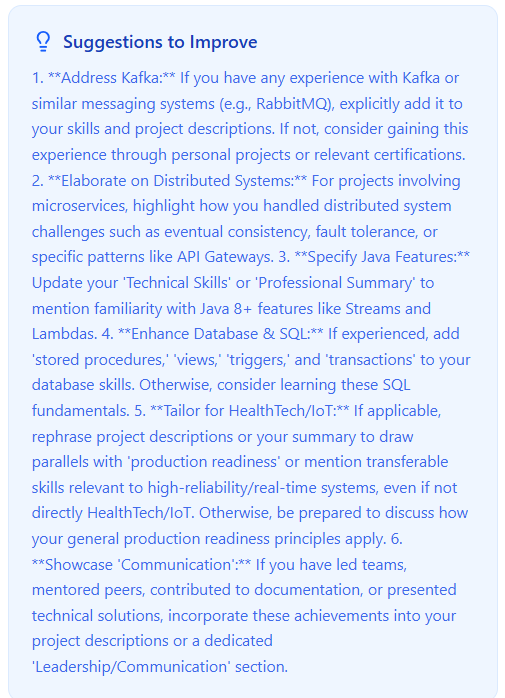
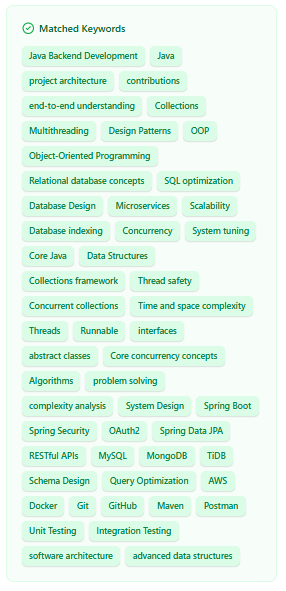
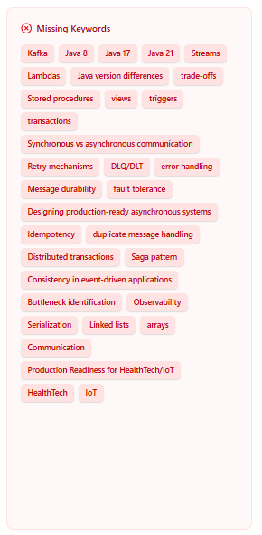
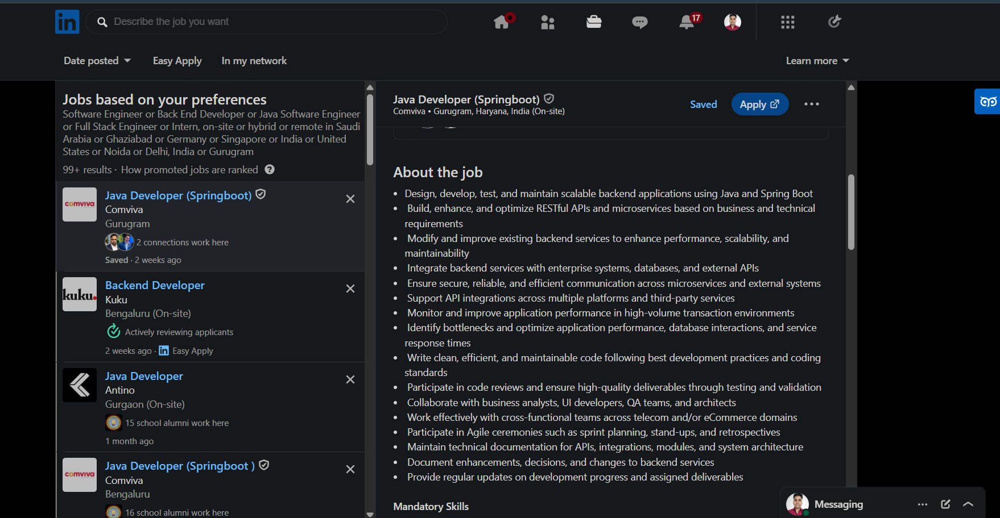
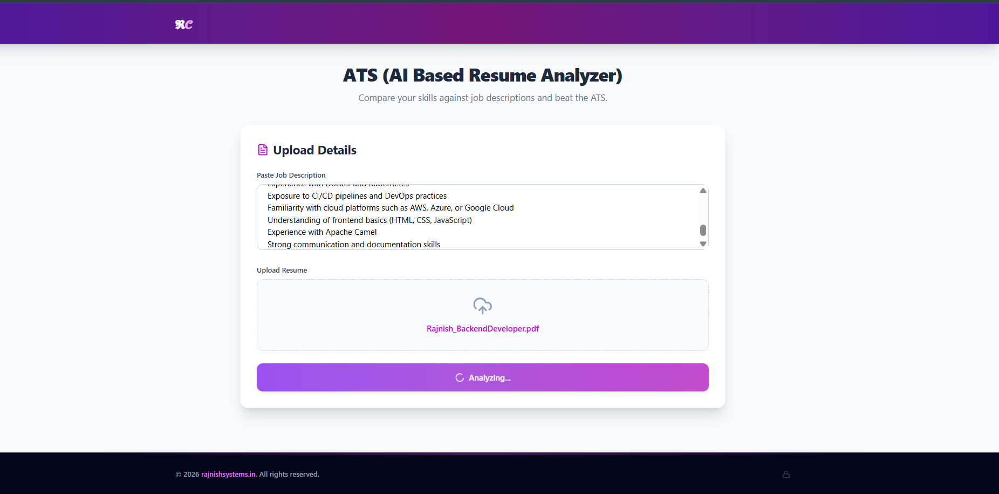
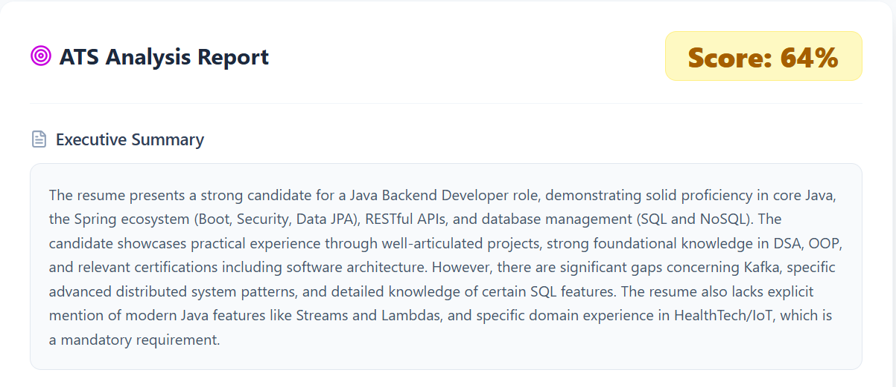

## Resume Analyser

An intelligent, full-stack web application designed to evaluate candidate resumes against specific Job Descriptions (JDs). By leveraging Google's Gemini AI, the system automatically extracts text, analyzes keyword matches, provides actionable improvement suggestions, and assigns an overall compatibility score.



## Features

* **AI-Powered Analysis:** Integrated with the Google Gemini AI API to provide intelligent, contextual suggestions for resume improvements.

  
  <br>
  

* **Real-time Processing:** Utilizes multi-threading and robust Exception Handling to ensure fast, efficient response generation.
* **Responsive UI:** A modern, clean, and professional interface built with React, JSX, and Tailwind CSS.
* **Keyword Optimization:** Automates the extraction of key skills from Job Descriptions (JD) and compares them against user resumes to suggest targeted optimizations.

  
  <br>
  

## Tech Stack

**Frontend:**
* React.js
* JSX
* Tailwind CSS

**Backend:**
* Java
* Spring Boot
* Google Gemini AI API
* Exception Handling & Multithreading
* MongoDB
* Apache Tika

**Tools & Testing:**
* Postman (End-to-end API Testing)
* Git & GitHub (Version Control)

## How It Works
* **Document Upload:** The user navigates to the UploadForm.jsx component and submits their resume file along with a text Job Description.

  

* **File Processing:** The backend ResumeController receives the multipart request. FileUploadConfig ensures size limits are respected. The text is extracted from the document.

* **AI Inference:** The backend constructs a prompt combining the extracted resume text and the JD. This is sent to the Gemini API, requesting a structured JSON response containing the score and suggestions.

  

* **Data Persistence:** The response from Gemini is mapped to the ResumeDocument model and saved in MongoDB using the repository layer.

* **Result Display:** The frontend receives the JSON response and dynamically renders the score and feedback in the ResultsBoard.jsx.

  
## 📂 Project Structure
### Backend Structure
```text
src
└── main
    ├── java
    │   └── com.project.resumeanalyser
    │       ├── config
    │       │   └── FileUploadConfig.java
    │       ├── controller
    │       │   └── ResumeController.java
    │       ├── model
    │       │   └── ResumeDocument.java
    │       ├── repo
    │       │   └── (Repository Interfaces)
    │       └── ResumeAnalyserApplication.java
    └── resources
        ├── static
        ├── templates
        ├── application.properties
        ├── application-prod.properties
        └── application-test.properties
```
### Frontend Structure
```text
src
├── assets
├── components
│   ├── AdminDashboard.jsx
│   ├── api.jsx
│   ├── Footer.jsx
│   ├── Header.jsx
│   ├── Layout.jsx
│   ├── ResultsBoard.jsx
│   └── UploadForm.jsx
├── App.jsx
├── index.css
└── main.jsx
```
### API Endpoints
* All backend endpoints are prefixed with ``@RequestMapping("/api/resume").``

* POST ``/api/resume/analyze``

* Payload: multipart/form-data (Resume PDF/Word file + JD Text).

* Action: Parses the document, sends a structured prompt to the Gemini API, calculates the score, saves the record to MongoDB, and returns the analysis.

* GET ``/api/resume/history``

* Action: Fetches the list of previously analyzed resumes for the current user/session to display on the frontend selection board.

* GET ``/api/resume/{id}``

Action: Retrieves the specific details, score, and suggestions of a past analysis from the database.
## Getting Started

### Prerequisites
* JDK 19+ or higher
* React.js & npm
* API Key for Google Gemini AI

### Backend Setup
* Clone Repo
```text
git clone https://github.com/Rajnish-chauhan/ats-resume-check
```
* Navigate to the backend project root.
* Open application.properties and configure your database and API credentials
* Build and run the application:
```text
mvn clean install
mvn spring-boot:run
```
### Frontend Setup
* Navigate to the frontend directory containing the React app.
```text
cd frontend
```
* Install dependencies:
```text
npm install
```
* Configure your backend URL in your api.jsx or a .env file:
```text
VITE_API_BASE_URL=http://localhost:8080/api/resume
```
* Start the Vite development server:
```text
npm run dev
```
---
# 🤝 Let's Connect

**Rajnish Chauhan** | Backend Software Engineer

*Engineered with a focus on scalable backend system design, clean code principles, and seamless third-party service integration.*

I am a Backend Developer passionate about building scalable APIs and robust backend systems using Java and Spring Boot. Check out my other projects or get in touch!

**🌐 Portfolio:** [rajnishsystems.in](https://rajnishsystems.in)